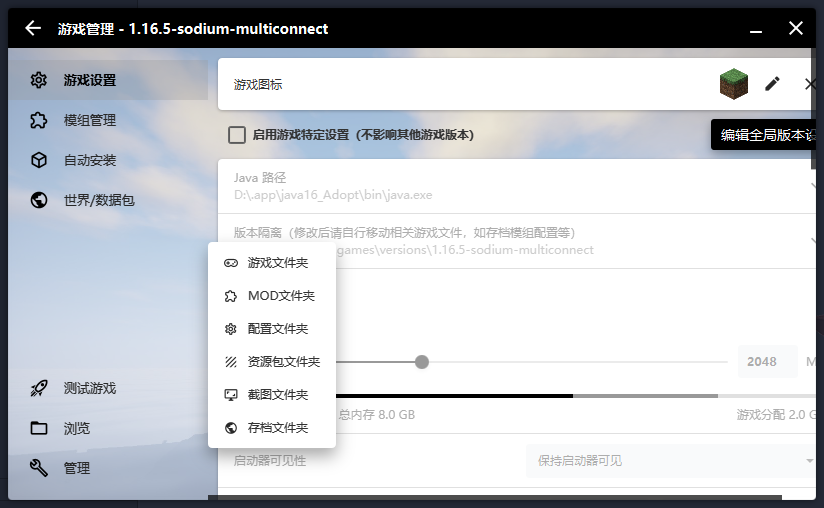

> 本文由 LIPiston 编写。
=======
这是一个游戏客户端很多不方便寻找的最佳解决方案<br/>
**注意：改方法会改变默认的 minecraft 文件结构**

## 使用方式
进入 hmcl 的`设置`

在全局设置中找到 `版本隔离`
改为 `各版本独立`

这时候 minecraft 的文件结构就会有所改变
```
.minecraft
|*asstes
|*libraries
|*versions
    \1.16.5-optifine
        |1.16.5-optifine.jar
        |*saves
        |*resourcepacks
        |*logs
        |*mods
        |*config
        ......
```
并非在 .minecraft 文件夹中存储一切的 mod 和 资源包**而是各版本的资源互相独立**

这样你就可以在一个目录下，安装多个客户端

## 往后的使用
在做完版本隔离的设置后，hmcl 的快速打开各个游戏文件夹的功能就会显得十分重要。



善用该功能也可为你的磁盘剩下不少的空间
