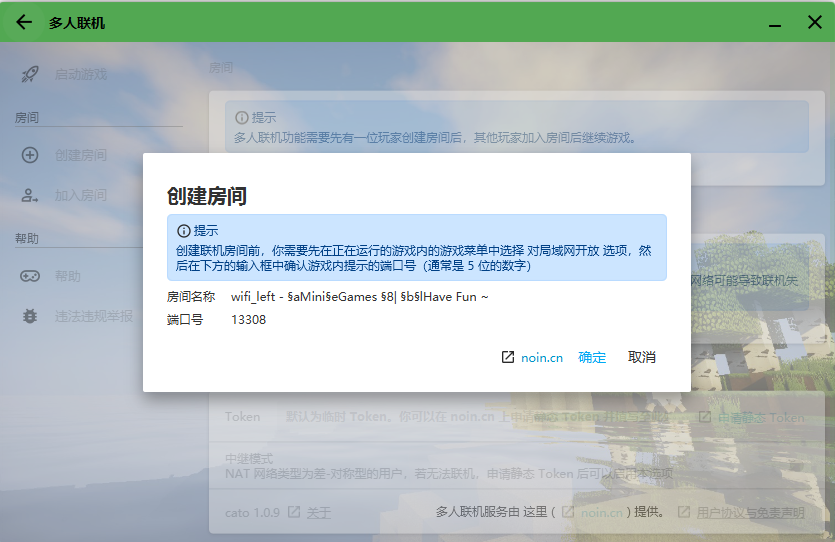

# HMCL 联机教程 v1.0

## 注意

请在使用多人联机模块之前您需要同意 [HMCL 用户协议](https://hmcl.huangyuhui.net/eula)。

HMCL 联机模块使用了第三方软件 [Cato](https://noin.cn/71.html)，所以您也需要同意 [用户协议与免责声明  - 这里 (noin.cn)](https://noin.cn/agreement)。

联机需要使用网络，请确保您的网络通畅。

请注意，**HMCL 只负责提供功能，在法律许可范围内，开发者不对本软件提供任何保证。 用户使用本软件所造成的的风险均由用户自行承担。**

## 打开方式

打开 HMCL，您将看到主页左下方 `多人联机` 提示。

左键此处，您将会打开联机页面。

### 一些问题

#### 房间是什么？

房间就是一个游戏集群。

只有您加入联机房间后，才能进行联机。

#### 房主是什么？

在每一个房间内，房间的主人叫做房主。

控制存档、玩家等的人就是房主。

#### 存档应该放在哪？

存档是由房主决定的。

房主需要把存档放进游戏目录内。

比如 `.minecraft\saves` 。

#### 玩家由谁控制？

玩家是由房主控制的。

房主可以邀请玩家进入房间、踢出房间等。

### 启动游戏

单击此处后，您将会启动当前主界面所选游戏。

HMCL 此时不会关闭界面。

### 创建房间

如果您想要让朋友们一起来玩，您可以点击此处创建房间。

**在创建房间之前，请先启动您的游戏！**

等待游戏启动后，请进入您的地图，打开游戏菜单（默认按下键盘上的 `ESC` 打开）。

单击 `对局域网开放` 。

设置好所有内容后，点击确认按钮后，将会出现对局域网开放成功的信息。（如下图红色边框内的信息）

此时，请回到 HMCL 多人联机界面。点击 `创建房间` ，您将看到您的局域网游戏已经被正确识别。

单击确认按钮，即可创建房间。

创建完毕后，点击 `复制邀请码` ，将邀请码复制到您的粘贴板内。

您可以将这串代码粘贴给您的朋友，此时，您这边的工作已经大体完毕。

当玩家想要加入您的房间时，将会弹出确认信息。

确认后，玩家使用相同版本进入游戏，打开 `多人游戏` 界面，等待少许时间，即可在下方 `局域网联机` 板块找到您的房间。

当您不想玩时，请点击 `关闭房间` 来关闭这个房间，以免 Cato 在后台占用您的资源。

### 加入房间

如果您获得了玩家的邀请码，请单击 `加入房间`，在输入框中粘贴您的邀请码。点击确定后等待房主允许您加入房间。

房主允许后，此时您可以启动游戏。**在联机游玩过程中，请不要退出 HMCL，否则将无法继续联机！**

请使用**和房主相同的游戏客户端**。您可以询问房主，获取客户端信息。

进入游戏后，打开 `多人游戏` 界面。等待少许时间后，即可在下方 `局域网联机` 区域找到房主的房间。

点击 `加入服务器` 后即可游玩。

如果您想退出房间，请点击启动器内 `退出房间` 即可。

## 常见问题

### 无法创建房间

请确认您的网络连接状态。并确认您已经接入互联网。

**（以下为稍微专业一些的内容，如果您看不懂可以跳过）**

请确保您已经关闭防火墙或者将 HMCL 与 Cato 加入防火墙允许列表。

在多人联机界面中，查看您的 NAT 网络类型。

共有如下几种类型：

未知类型

极差（网络禁止 UDP 协议）

差（对称型+防火墙）

差（对称型）

中（端口受限圆锥型）

中（受限圆锥型）

中（完全圆锥型）

好（公网开放型）

其中，`极差` 环境下您可能无法进行联机。

在 `差` 环境下，您大概率无法创建房间，但您能进入类型为 `好` 的房间。

在 `中` 环境下，所有处于 `中` 或 `好` 类型的人能与您进行联机。

如果您的类型是 `好` ，您可以直接使用公网IP进行联机。使用公网IP联机请查阅网上的资料。

您还可以尝试 `中级模式` ，获取到 静态 Token 后，输入进 HMCL，即可打开中级模式。

此模式与映射相似，但仍可能出现无法联机的情况。

**若您符合条件但仍然无法创建房间，请在 GitHub 反馈。**

### 服务器延迟高

理论上讲，人的多少和延迟没有关系。

所以可能是 电脑较卡 或者 网络信号不良 导致的。

### 无法加入房主的服务器

可能原因：

* 房主拒绝您加入
* 处理时间超时
* P2P 服务器维修 / 被阻止
* 您电脑上的杀毒软件 / 防火墙阻止 HMCL 与 Cato 访问网络。

请查看您的 NAT 网络类型 ，并查看上面的信息进行检查。

**若出现 BUG，请在 GitHub 反馈。**

## 存在问题

**请到 [GitHub](https://github.com/huanghongxun/HMCL) 进行反馈！**
