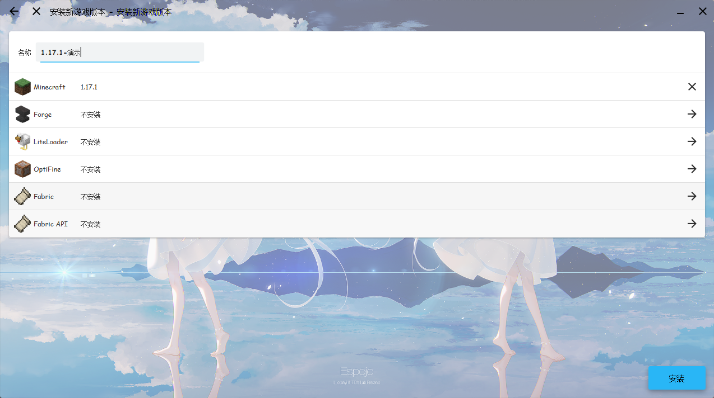
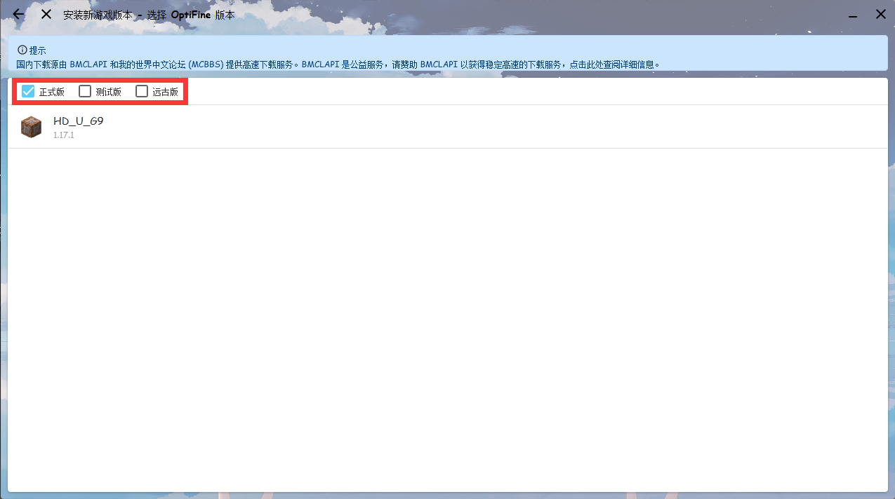
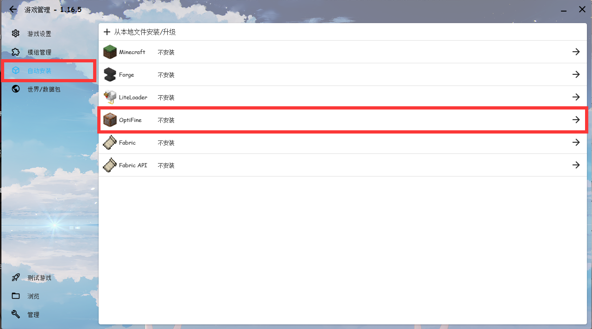
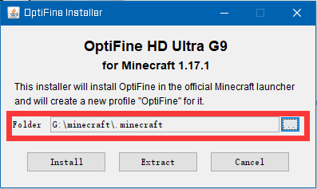
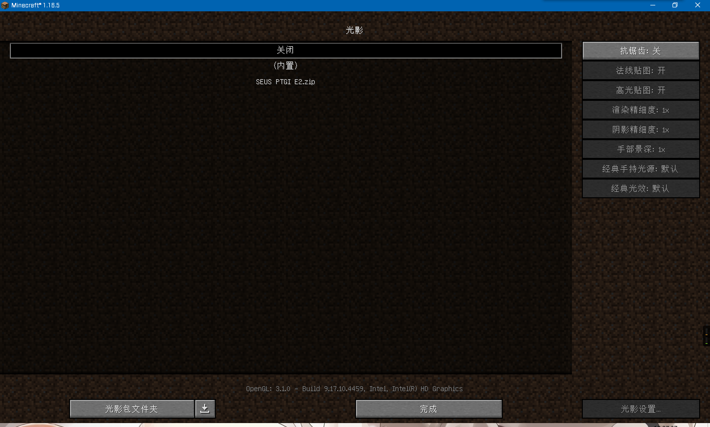

# 光影和Optifine

## 安装Optifine

### 方式一：全新安装

当你在安装新的游戏客户端时候，会看到有个`Optifine`的选项。

点开之后会看到有3个复选框，一般而言，`正式版`会比`测试版`更加稳定。选择安装`正式版`，如果没有`正式版`那么再考虑`测试版`。

选择完合适的版本之后就可以点击右下角的`安装`继续进行安装。

### 方式二：修改/升级已安装版本

在对应的游戏版本管理页面，点击`自动安装`，你会看到有个`Optifine`的选项。

点开之后选择合适的版本然后等待安装完成即可。
目前，要在`Fabric`使用`Optifine`需要通过**方式四**安装。。

### 方式三：官网安装

在[Optifine官网](https://www.optifine.net/)上下载合适版本的Optifine（下载完应为`OptiFine_<游戏版本>_<Optifine版本>.jar`）。

双击打开或者使用`java -jar 文件名` 的方式打开，然后你就会看到这个界面。

选择自己游戏的.minecraft目录（默认安装到`\AppData\Roaming\.minecraft`目录下），然后点击`Install`按钮，之后你在HMCL的版本列表中找到就含有Optifine名字的客户端启动即可。

如果提示未找到，请确认你是否已安装对应的版本的客户端，且**命名为对应版本号**的原本游戏客户端。

### 方式四：Optifine 与 Mod 加载器共存

从[Optifine官网](https://www.optifine.net/)上下载的jar文件本身也可作为Mod被加载，可以用 Java 运行下载的文件并导出 Mod 版本。Mod 安装具体方法见 [Mod安装教程](auto-installing.html)

注意：

1.Fabric和Optifine本身并不能共存，必须同时安装[Optifabric](https://www.curseforge.com/minecraft/mc-mods/optifabric)（一个Fabric Mod）。
  Optifabric 目前 1.17 仅支持`OptiFine HD U G9`、`Fabric` 最高支持的版本为`0.11.7` 。

2. Forge和Optifine会出现不兼容的情况，但大多数情况下，forge 和 optifine 是相互支持的（多半是后者修改后能兼容前者）。
3. 若出现不兼容的情况，请使用[Optiforge](https://www.curseforge.com/minecraft/mc-mods/optiforge)（一个Forge Mod）解决。

## 安装光影

一般光影是一个zip格式的文件，将光影文件放入`\.minecraft\shaders`文件夹中即可 (没有这个文件夹就自己新建一个)。如果开了版本隔离，那么文件夹是`\.minecraft\version\<客户端名称>/shaders`

如果你不知道版本隔离是啥，也不会创建文件夹，那么请打开游戏，依次点击`设置—视频设置—光影—光影包文件夹`，在里面放入光影包，然后点击你要加载的光影，最后点击`完成`即可

**注意：光影对于电脑配置的要求比较高，如果开了光影之后出现游戏画面很卡的情况，请升级电脑配置、使用低配置光影或者关闭光影。**
