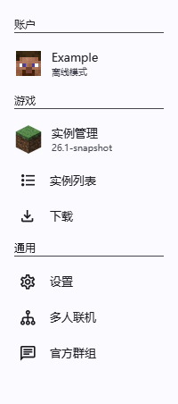

启动器界面整体由顶部工具栏和页面容器构成。

## 顶部工具栏

:::tip
用户可以通过双击工具栏在最大化与普通窗口状态之间切换。
:::

此区域为全局显示，共分为左右两部分。其中左侧由返回按钮（仅在二级或多级页面显示）和标题构成，右侧由帮助按钮、最小化按钮和关闭按钮构成。

**返回按钮**：点击后返回上一页，仅在二级或多级页面上显示，首页不显示。\
**标题**：通常用于显示页面名称，首页显示为启动器版本信息。\
**帮助按钮**：点击后跳转至文档帮助页面。\
**最小化按钮**：点击后最小化启动器。\
**关闭按钮**：点击后关闭启动器。

## 首页

首页是启动器的起始页面，该页面由侧边导航栏、提示面板（仅限开发版和预览版）、更新面板（仅在存在可用更新时显示）和启动游戏面板构成。

### 侧边导航栏（首页）

此区域共分为三部分：账户分组、游戏分组及通用分组。

**账户分组**：该分组中包含一个列表项，该项会显示当前选定的账户头像、名称及账户类型，用户点击该项可进入账户列表页面；右键点击该项可呼出账户切换的快捷菜单。

:::tip
用户在该项上滚动鼠标滚轮可在不同账户之间进行快捷切换。
:::

**游戏分组**：该分组中包含三个列表项，分别是：实例管理、实例列表及下载。

- 实例管理：该项会显示当前选定的游戏实例图标及名称。用户点击该项后进入实例管理页面；在该项上滚动鼠标滚轮可在不同游戏实例之间进行快捷切换。
- 实例列表：用户点击该项后进入实例列表页面，用于查看和管理游戏实例。
- 下载：用户点击该项后进入下载页面，用于下载游戏、整合包或者安装模组、资源包、光影或者世界。

**通用分组**：该分组中包含三个列表项，分别是：设置、多人联机及官方群组。

- 设置：用户点击该项后进入[设置](#设置)页面。
- 多人联机：用户点击该项后进入多人联机页面。
- 官方群组：用户点击该项后跳转至设置·反馈页。

### 提示面板

:::tip
用户可通过点击右上角关闭按钮隐藏该提示。
:::

仅在开发版或预览版中显示，用于提示用户当前启动器不是稳定版本。

### 更新面板

仅在存在可用更新时显示，此区域用于启动器更新提示。

### 启动游戏面板

此区域共分为两部分：启动（开始）游戏按钮、切换实例菜单。

**启动（开始）游戏按钮**：若用户当前存在实例，点击后则会启动当前应用的游戏实例；若当前不存在游戏实例，点击后会自动下载最新正式版然后启动游戏。\
**切换实例菜单**：点击显示快捷切换游戏实例列表菜单。

## 设置

该页面由侧边导航栏和页面容器构成。

### 侧边导航栏（设置）

此区域共分为四部分：全局游戏设置、Java 管理、启动器分组及帮助分组。

**全局游戏设置**：用户点击该项后进入[全局游戏设置](#设置-全局游戏设置)页面。\
**Java 管理**：用户点击该项后进入 Java 管理页面。\
**启动器分组**：该分组中包含三个列表项，分别是：通用、外观及下载。\
**帮助分组**：该分组中包含三个列表项，分别是：帮助、反馈及关于。

## 设置-全局游戏设置

